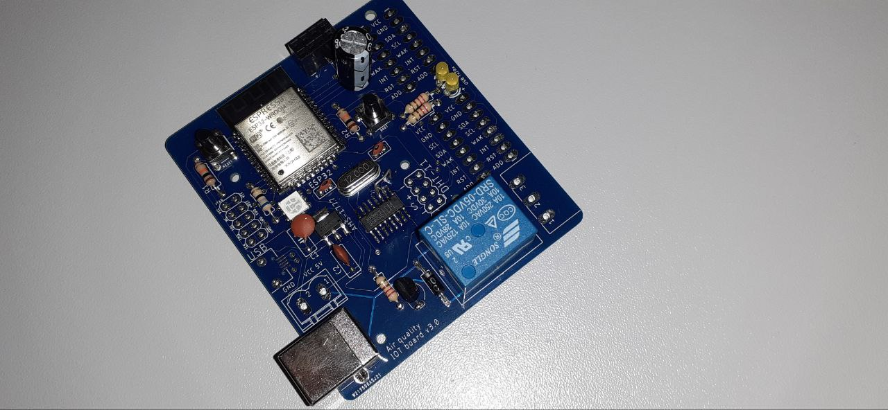
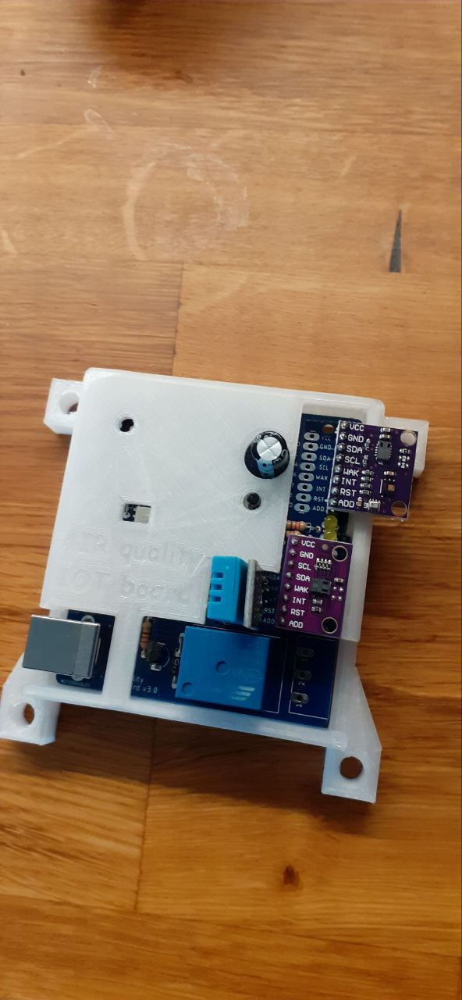

This board, designed with KiCad and programmed with Arduino, features an ESP-32 WROOM.  

The board can read CO2, TVOC, humidity, atmospheric pressure, and altitude values from multiple SPI sensors. The CO2 sensor used is the CCS811, and the board allows for the installation of two sensors, distinguished by different addresses.  
  
  
  
For programming, an external serial converter can be used, or it can be programmed directly via the USB port using the CH340G, which is mounted at the center of the board.  
  
  